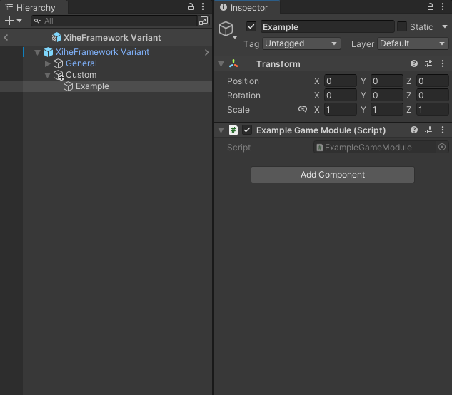

# Create a Custom GameModule

## Create a C# class

1. import **XiheFramework.Modules.Base**
2. inherit from GameModule
3. override functions from GameModule (Note: `Setup()` is optional)

```
using UnityEngine;
using XiheFramework.Modules.Base;

public class ExampleGameModule : GameModule {

    public void HelloWorld() {
        Debug.Log("HelloWorld!");
    }

    internal override void Setup() {
        //TODO: Setup data, Setup() is called after all modules are ready
    }

    internal override void OnUpdate() {
        //TODO: treated as a regular Unity Update() function
    }

    internal override void OnFixedUpdate() { }

    internal override void OnLateUpdate() { }

    internal override void ShutDown(ShutDownType shutDownType) {
        //TODO: any logic before the framework is being shutdown or restarted
    }
}
```

## Place It in the Framework Prefab



# Use the Custom GameModule

## Option 1: Create Custom `Game` Static Class

> [!NOTE]
> All `Game` classes must be put inside `XiheFramework` namespace.

```
using XiheFramework.Modules.Base;

namespace XiheFramework {
    public static partial class Game {
        public static ExampleGameModule Example => GameManager.GetModule<ExampleGameModule>();
    }
}
```

```
using UnityEngine;
using XiheFramework;

public class UsingExampleModule : MonoBehaviour {
    private void Start() {
        Game.Example.HelloWorld();
    }
}
```

## Option 2: Get Game Module (Slower)
```
using UnityEngine;
using XiheFramework;

public class UsingExampleModule : MonoBehaviour {
    private void Start() {
        Game.GetModule<ExampleGameModule>().HelloWorld();
    }
}
```