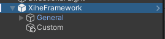
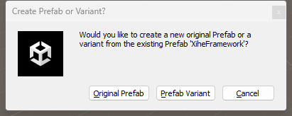

# Get Start

## Prerequisites

1. FlowCanvas
2. Amplify Shader Editor (Optional)

## Import XiheFramework via Git Submodule

To import XiheFramework into your Unity project, open a terminal window from the project root directory and run the following command:
```
    git submodule add https://github.com/sky-haihai/XiheFramework.git Assets/XiheFramework
```
    
## Framework Setup


1. Drag the XiheFramework.prefab into any scene from path Assets/XiheFramework
2. **[Optional]** Create a empty GameObject named "Custom"(Or any name you want) under XiheFramework. This is the place where you can place your custom [GameModule](/../api/XiheFramework.Modules.Base.GameModule.html) 



3. Drag the prefab back to your preferred directory (e.g. Assets/Prefabs) as a **Prefab Variant**.

